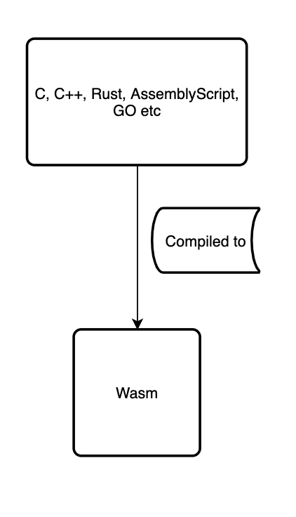

经过编译，得到wasm文件。

# Integrate with Flutter Web / 集成到flutter
我想到的集成方案。
* flutter插件方式集成。把wasm的文件放入assets，dart内部加载它；这种方式最便于代码的复用 
    * （失败，1.路径加载失败，2.貌似加载到二进制，但方法调用没有反应）
    * https://pub.dev/packages/wasm_interop flutter加载wasm，
* 直接集成到主项目，通过index.html加载wasm模块。再使用dart调用，
    * 缺点代码与主项目绑定，复用代码需要迁移

## 插件实现方案
1. 编译wasm，携带js，wasm文件
2. wasm导入web项目的html部分，通过script导入js+wasm
3. dart这边，`import 'package:js/js.dart';` 注解方式绑定js到dart


```html
<!-- 方案1异步导入 -->
<script async type="text/javascript" src="wasm/cmake-emscripten-explore.js"></script>
<!-- 方案2同步加载，增加回调函数 -->
<script type="text/javascript" src="wasm/cmake-emscripten-explore.js"></script>
<script>
Module.onRuntimeInitialized = _ => {
    console.log(`js -> Module init ${Module._version()}`);
    console.log(`js -> Module init ${Module._add(1,3)}`);
};
</script>
```
需要单独写注解库。并以library开头
```dart
@JS()
library f_wasm;

import 'package:js/js.dart';

@JS("window.Module")
class Module {
  @JS("_version")
  external static String version();
  @JS("_add")
  external static int add(int a, int b);
}
```